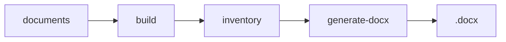

# Referência: Estrutura e exemplos de README GitHub

Documentação de apoio à skill **github-readme**. Usar para detalhes de badges, blocos comuns e exemplos de secções.

---

## 1. Badges (shields.io)

### Formato genérico

```markdown
[](URL)
```

### Estilo "for-the-badge" (mais largo)

```markdown
[](https://laravel.com)
[](https://vuejs.org)
```

### Estilo flat (texto simples)

```markdown
[](https://nodejs.org/)
[](https://www.ruby-lang.org/)
[](https://www.postgresql.org/)
[](LICENSE)
```

### Boas práticas

- Uma linha de badges logo abaixo do título/versão.
- Incluir: linguagem, runtime, framework principal, BD, ferramentas (Docker, Mermaid, etc.), licença.
- Manter o mesmo estilo (for-the-badge ou flat) em todo o README.

---

## 2. Título e descrição

### Título (H1)

- Nome do repo/projeto; opcionalmente emoji no início: `# 🚀 Nome do Projeto`.
- Seguido de linha em branco e, se quiser, versão ou tagline em negrito.

Exemplo:

```markdown
# document-llm-creator

**Version 1.1.0** — Tables, **bold** in text, Mermaid images, example showcase.
```

### Descrição

- Um ou dois parágrafos: o que é, para que serve, destaque principal.
- Pode incluir link para documentação extra (ex.: `.agents/README.md`).

---

## 3. Preview (imagem / GIF)

Colocar após a descrição, com legenda em *itálico*:

```markdown
## 🖼️ Application Preview


*Legenda opcional descrevendo a imagem.*
```

---

## 4. Diagramas Mermaid

- No GitHub, Mermaid é renderizado nativamente dentro de blocos ` ```mermaid `.
- Para README em outros contextos (ex.: Word/PDF), pode ser necessário exportar PNG e usar ``.

Exemplo de bloco no README:

```markdown
## How it works


*Diagram source: docs/pipeline.mmd. Regenerate PNG with `node scripts/render-readme-diagram.js`.*
```

Se o diagrama ficar no próprio README, use um bloco assim (no README final):

````

````

---

## 5. Quick start

- Secção com título tipo "Quick start" ou "Quick steps".
- Pré-requisitos em lista.
- Passos numerados com comandos em blocos de código (bash, shell).
- Links para URLs (app, admin, auth) se aplicável.

Exemplo mínimo:

- **Prerequisites:** Ruby 3.2+, Docker and Docker Compose
- **Clone and install:** `git clone ...`, `cd repo`, `bundle install`
- **Setup and run:** `rails db:create db:migrate db:seed`, `rails server`
- **App:** http://localhost:3000

---

## 6. Tabelas (comandos, estrutura)

### Comandos

| Command | Description |
|--------|-------------|
| `npm run doc -- <id>` | Build and generate document. |
| `npm run new-doc -- <id>` | Create new document folder. |
| `rails server` | Start the application. |

### Estrutura do projeto

| Path | Description |
|------|-------------|
| `core/` | Build, generate, config. |
| `documents/<id>/` | Manifest, spec, section JSONs. |
| `output/` | Generated .docx and artifacts. |

---

## 7. Exemplo mínimo de uso

Incluir um bloco "Example" ou "Quick example" com comandos que funcionem de imediato (ex.: `npm install`, `npm run doc -- example`).

---

## 8. Licença

No final do README:

```markdown
## License

MIT — see [LICENSE](LICENSE).
```

---

## 9. Checklist antes de gerar (para o agente)

- [ ] Nome do projeto e descrição confirmados
- [ ] Badges: linguagem(s), libs principais, licença
- [ ] Objetivo / "How it works" definido
- [ ] Quick start com passos e comandos
- [ ] Mermaid ou imagem de preview só se o utilizador quiser
- [ ] Tabelas de comandos e estrutura se fizerem sentido
- [ ] Exemplo de uso e licença

Depois de recolher as respostas, **perguntar**: "Queres alterar algo antes de eu gerar o README?" e só então escrever.
